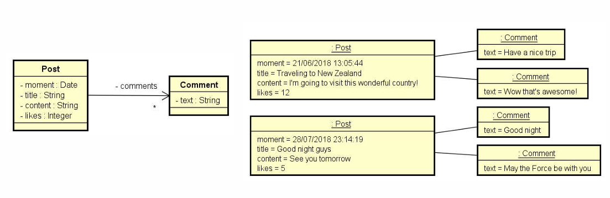

## Instancie manualmente (hard code ) os objetos mostrados abaixo e mostre-os na tela do terminal, conforme exemplo 

### Traveling to New Zealand
### _12 Likes -21/06/2018 13:05:44_
### _I'm going to visit this wonderful country!_
### Comments:
### _Have a nice trip_
### _Wow that's awesome!_
----------
### _Good night guys_
### _5 Likes -28/07/2018 23:14:19_
### _See you tomorrow_
### Comments:
### _Good night_
### _May the Force be with you_