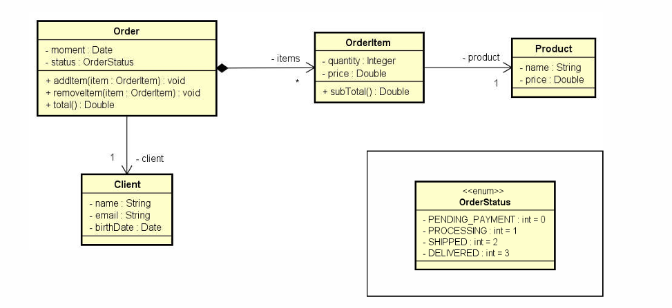
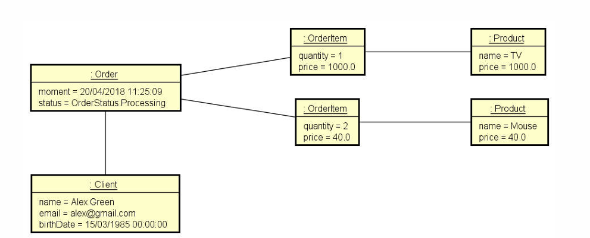

##  Ler os dados de um pedido com N itens (N fornecido pelo usuário). Depois, mostrar um sumário do pedido conforme exemplo (próxima página). Nota: o instante do pedido deve ser o instante do sistema: new Date()

 #### Enter cliente data:
 #### Name: _Alex Green_
 #### Email: _alex@gmail.com_
 #### Birthdate (DD/MM/YYYY): _15/03/1985_
 ----------------------------------
 #### Enterorderdata:
 #### Status: _PROCESSING_
 #### How many item sto this order? _2_
 --------------------------------
 #### Enter#1 item data:
 #### Product name: _TV_
 #### Product price: _1000.00_
 #### Quantity: _1_
 #### Enter#2 item data:
 #### Product name: _Mouse_
 #### Product price: _40.00_
 #### Quantity: _2_
 ---------------------------------
 #### ORDER SUMMARY:
 #### Order moment: _20/04/2018 11:25:09_
 #### Order status: _PROCESSING_
 #### Client: _Alex Green (15/03/1985) -alex@gmail.com_
 #### Order items:
 #### _TV, $1000.00, Quantity: 1, Subtotal: $1000.00_
 #### _Mouse, $40.00, Quantity: 2, Subtotal: $80.00_
 #### *_Total price: $1080.00_*

 