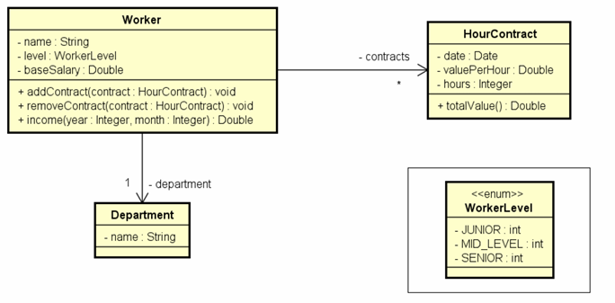

##  Ler os dados de um trabalhador com N contratos (N fornecido pelo usuário). Depois, solicitar do usuário um mês e mostrar qual foi o salário do funcionário nesse mês, conforme exemplo (próxima página).

---------
  

-----------
### Enter department's name: __Design__ 
### Enter worker data:
### Name: __Alex__
### Level: __MID_LEVEL__
### Base salary: __1200.00__
---------
### How many contracts to this worker? __3__
### Enter contract #1 data:
### Date (DD/MM/YYYY): __20/08/2018__
### Value per hour: __50.00__
### Duration (hours): __20__
--------
### Enter contract #2 data:
### Date (DD/MM/YYYY): __13/06/2018__
### Value per hour: __30.00__
### Duration (hours): 18
--------
### Enter contract #3 data:
### Date (DD/MM/YYYY): __25/08/2018__
### Value per hour: __80.00__
### Duration (hours): __10__
--------
### Enter month and year to calculate income (MM/YYYY): _08/2018_
### Name: _Alex_
### Department: _Design_
### Income for 08/2018: _3000.00_